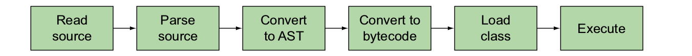

= Compile-time metaprogramming and AST transformations

=== Making Groovy cleaner and leaner

Groovy ships with many AST transformations that you can use today to get rid of
those annoying bits of repetitive code in your classes. When applied properly, the
annotations described here make your code less verbose, so that the bulk of the
code expresses meaningful business logic to the reader instead of meaningful code
templates to the compiler. AST transformations cover a wide range of functionality,
from generating standard toString() methods, to easing object delegation, to clean-
ing up Java synchronization constructs, and more.

==== Code-generation transformations

====== @GROOVY.TRANSFORM.TOSTRING

[source,groovy]
----
import groovy.transform.ToString
@ToString
class Detective {
    String firstName, lastName
}
def sherlock = new Detective(firstName: 'Sherlock', lastName: 'Holmes')
assert sherlock.toString() == 'Detective(Sherlock, Holmes)'
----

[source,groovy]
.Using @ToString with annotation parameters
----
import groovy.transform.ToString
@ToString(includeNames = true, ignoreNulls = true)
class Sleuth {
    String firstName, lastName
}

def nancy = new Sleuth(firstName: 'Nancy', lastName: 'Drew')
assert nancy.toString() == 'Sleuth(firstName:Nancy, lastName:Drew)'
nancy.lastName = null
assert nancy.toString() == 'Sleuth(firstName:Nancy)'
----

==== @GROOVY.TRANSFORM.EQUALSANDHASHCODE

[source,groovy]
----
import groovy.transform.EqualsAndHashCode
@EqualsAndHashCode
class Actor {
    String firstName, lastName
}
def magneto = new Actor(firstName:'Ian', lastName: 'McKellen')
def gandalf = new Actor(firstName:'Ian', lastName: 'McKellen')
assert magneto == gandalf
----

==== @GROOVY.TRANSFORM.TUPLECONSTRUCTOR

[source,groovy]
----
import groovy.transform.TupleConstructor
@TupleConstructor
class Athlete {
    String firstName, lastName
}
def a1 = new Athlete('Michael', 'Jordan')
def a2 = new Athlete('Michael')
assert a1.firstName == a2.firstName
----

==== @GROOVY.TRANSFORM.LAZY

Lazy instantiation is a common idiom in Java. If a field is expensive to create, such as
a database connection, then the field is initialized to null , and the actual connec-
tion is created only the first time that field is used. Typical in this idiom is a null
check and instantiation within a getter method. But not only is this boilerplate code,
there are numerous tricky scenarios, such as correctly handling creation in a multi-
threaded environment, which are error-prone. The @Lazy field annotation correctly
delays field instantiation until the time when that field is first used and correctly handles numerous tricky special cases.

[source,groovy]
----
class Resource {
    private static alive = 0
    private static used = 0

    Resource() { alive++ }

    def use() { used++ }

    static stats() { "$alive alive, $used used" }
}

class ResourceMain {
    def res1 = new Resource()
    @Lazy res2 = new Resource()
    @Lazy static res3 = { new Resource() }()
    @Lazy(soft=true) volatile Resource res4
}

new ResourceMain().with {
    assert Resource.stats() == '1 alive, 0 used'
    res2.use()
    res3.use()
    res4.use()
    assert Resource.stats() == '4 alive, 3 used'
    assert res4 instanceof Resource
    def expected = 'res4=java.lang.ref.SoftReference'
    assert it.dump().contains(expected)
}
----

===== @GROOVY.TRANSFORM.INDEXEDPROPERTY

[source,groovy]
.Using @IndexedProperty to generate index-based setters and getters
----
import groovy.transform.IndexedProperty

class Author {
    String name
    @IndexedProperty List<String> books
}
def books = ['The Mysterious Affair at Styles',
             'The Murder at the Vicarage']
new Author(name: 'Agatha Christie', books: books).with {
    books[0] = 'Murder on the Orient Express'
    setBooks(0, 'Death on the Nile')
    assert getBooks(0) == 'Death on the Nile'
}
----

==== @GROOVY.TRANSFORM.INHERITCONSTRUCTORS

The @InheritConstructors annotation removes the boilerplate of writing match-
ing constructors for a superclass.

[source,groovy]
----
import groovy.transform.InheritConstructors

@InheritConstructors
class MyPrintWriter extends PrintWriter { }

def pw1 = new MyPrintWriter(new File('out1.txt'))
def pw2 = new MyPrintWriter('out2.txt', 'US-ASCII')

[pw1, pw2].each {
    it << 'foo'
    it.close()
}

assert new File('out1.txt').text == new File('out2.txt').text
['out1.txt', 'out2.txt'].each{ new File(it).delete() }
----

==== @GROOVY.TRANSFORM.SORTABLE

[source,groovy]
.Using @Sortable to generate Comparable / Comparator methods
----
import groovy.transform.Sortable
@Sortable(includes = 'last,initial')
class Politician {
    String first
    Character initial
    String last
    String initials() { first[0] + initial + last[0] }
}
def politicians = [
        new Politician(first: 'Margaret', initial: 'H', last: 'Thatcher'),
        new Politician(first: 'George', initial: 'W', last: 'Bush')
]
def sorted = politicians.toSorted()
assert sorted*.initials() == ['GWB', 'MHT']
def byInitial = Politician.comparatorByInitial()
sorted = politicians.toSorted(byInitial)
assert sorted*.initials() == ['MHT', 'GWB']
----

==== @GROOVY.TRANSFORM.BUILDER

[source,groovy]
----
import groovy.transform.builder.Builder
@Builder
class Chemist {
    String first
    String last
    int born
}

def builder = Chemist.builder()
def c = builder.first("Marie").last("Curie").born(1867).build()
assert c.first == "Marie"
assert c.last == "Curie"
assert c.born == 1867
----

.Built-in @Builder strategies
|===
|Strategy |Description

|DefaultStrategy |Creates a nested helper class for instance creation. Each method in the helper class returns the helper until finally a build() method is called, which returns a created instance.
|SimpleStrategy |Creates chainable setters, where each setter returns the object itself after updating the appropriate property.
|ExternalStrategy |Allows you to annotate an explicit builder class while leaving some builder class being built untouched. This is appropriate when you want to create a builder for a class you don’t have control over such as from a library or another team in your organization.
|InitializerStrategy |Creates a nested helper class for instance creation that when used
with `@CompileStatic` allows type-safe object creation. Compatible
with `@Immutable` .
|===

==== Class design and design pattern annotations

===== @GROOVY.TRANSFORM.CANONICAL

[source,groovy]
----
import groovy.transform.Canonical
@Canonical
class Inventor {
    String firstName, lastName
}
def i1 = new Inventor('Thomas', 'Edison')
def i2 = new Inventor('Thomas')
assert i1 != i2
assert i1.firstName == i2.firstName
assert i1.toString() == 'Inventor(Thomas, Edison)'
----

===== @GROOVY.TRANSFORM.IMMUTABLE

[source,groovy]
----
import groovy.transform.Immutable
import static groovy.test.GroovyAssert.shouldFail
@Immutable
class Genius {
    String firstName, lastName
}

def g1 = new Genius(firstName: 'Albert', lastName: "Einstein")
assert g1.toString() == 'Genius(Albert, Einstein)'

def g2 = new Genius('Leonardo', "da Vinci")
assert g2.firstName == 'Leonardo'
assert g1 != g2
shouldFail(ReadOnlyPropertyException) {
    g2.lastName = 'DiCaprio'
}
----

===== @GROOVY.LANG.DELEGATE

[source,groovy]
----
class NoisySet extends HashSet {
    @Override
    boolean add(item) {
        println "adding $item"
        super.add(item)
    }
    @Override
    boolean addAll(Collection items) {
        items.each { println "adding $it" }
        super.addAll(items)
    }
}

class NoisySet implements Set {
    private Set delegate = new HashSet()

    @Override
    boolean add(item) {
        println "adding $item"
        delegate.add(item)
    }

    @Override
    boolean addAll(Collection items) {
        items.each { println "adding $it" }
        delegate.addAll(items)
    }
    @Override
    boolean isEmpty() {
        return delegate.isEmpty()
    }
    @Override
    boolean contains(Object o) {
        return delegate.contains(o)
    }
// ... ditto for size, iterator, toArray, remove,
// containsAll, retainAll, removeAll, clear ...

}

class NoisySet {
    @Delegate
    Set delegate = new HashSet()
    @Override
    boolean add(item) {
        println "adding $item"
        delegate.add(item)
    }
    @Override
    boolean addAll(Collection items) {
        items.each { println "adding $it" }
        delegate.addAll(items)
    }
}

Set ns = new NoisySet()
ns.add(1)
ns.addAll([2, 3])
assert ns.size() == 3
----

===== @GROOVY.LANG.SINGLETON

[source,groovy]
----
class Zeus {
    static final Zeus instance = new Zeus()
    private Zeus() { }
}
assert Zeus.instance
----

[source,groovy]
.using @Singlton
----
import static groovy.test.GroovyAssert.shouldFail
@Singleton class Zeus { }
assert Zeus.instance
def ex = shouldFail(RuntimeException) { new Zeus() }
assert ex.message ==
        "Can't instantiate singleton Zeus. Use Zeus.instance"
----

===== @GROOVY.TRANSFORM.MEMOIZED

[source,groovy]
----
import groovy.transform.Memoized

class Calc {
    def log = []

    @Memoized
    int sum(int a, int b) {
        log << "$a+$b"
        a + b
    }
}

new Calc().with {
    assert sum(3, 4) == 7
    assert sum(4, 4) == 8
    assert sum(3, 4) == 7
    assert log.join(' ') == '3+4 4+4'
}
----

===== @GROOVY.TRANSFORM.TAILRECURSIVE

[source,groovy]
----
class ListUtil {
    static List reverse(List list) {
        if (list.isEmpty()) list
        else reverse(list.tail()) + list.head()
    }
}
assert ListUtil.reverse(['a', 'b', 'c']) == ['c', 'b','a']
----

[source,groovy]
----
import groovy.transform.TailRecursive
class ListUtil {
    static reverse(List list) {
        doReverse(list, [])
    }
    @TailRecursive
    private static doReverse(List todo, List done) {
        if (todo.isEmpty()) done
        else doReverse(todo.tail(), [todo.head()] + done)
    }
}
assert ListUtil.reverse(['a', 'b', 'c']) == ['c', 'b', 'a']
----

NOTE: The `Closure.trampoline()` method This method
      wraps the closure into a TrampolineClosure , which,
      instead of doing a recursive call to the closure, returns a new closure, which is called during the next
      step of the computation. This turns a recursive execution into a sequential
      one, thus helping avoiding the stack overflow, albeit at some performance cost.

==== Logging improvements

[source,groovy]
.Using @Log to inject a Logger object into an object
----
import groovy.util.logging.Log

@Log
class Database {
    def search() {
        log.fine(runLongDatabaseQuery())
    }

    def runLongDatabaseQuery() {
        println 'Calling database'
        /* ... */
        return 'query result'
    }
}

new Database().search()
----

.Five @Log annotations
|===
|Name |Description
|@Log |Injects a static final java.util.logging.Logger into your class and initializes it
using Logger.getLogger(class.name) .
|@Commons |Injects an Apache Commons logger as a static final
org.apache.commons.logging.Log into your class and initializes
it using LogFactory.getLog(class) .
|@Log4j |Injects a Log4j logger as a static final org.apache.log4j.Logger into your
class and initializes it using Logger.getLogger(class) .
|@Log4j2 |Injects a Log4j2 logger as a static final org.apache.log4j.Logger into your
class and initializes it using Logger.getLogger(class) .
|@Slf4j |Injects an Slf4j logger as a static final org.slf4j.Logger into your class and
initializes it using org.slf4j.LoggerFactory.getLogger(class) . The
|LogBack |framework uses SLF4J as the underlying logger, so LogBack users should
use @Slf4j .
|===

==== Declarative concurrency

===== @Synchronized

.Avoid low-level synchronization
****
Java contains many fine primitives for working with concurrent code, such as the syn-
chronized keyword and the contents of the java.util.concurrent package. But
these are mostly primitives and not abstractions. The tools are low level and meant
to serve as a foundation.
****

[source,groovy]
----
import groovy.transform.Synchronized

class PhoneBook1 {
    private final phoneNumbers = [:]

    @Synchronized
    def getNumber(key) {
        phoneNumbers[key]
    }

    @Synchronized
    void addNumber(key, value) {
        phoneNumbers[key] = value
    }
}

def p1 = new PhoneBook1()
(0..99).collect { num ->
    Thread.start{
        p1.addNumber('Number' + num, '98765' + num)
    }
}*.join()
assert p1.getNumber('Number43') == '9876543'
----

[source,groovy]
.Mixing @Synchronized with custom synchronized block
----
import groovy.transform.Synchronized
import groovy.util.logging.Log

@Log
class PhoneBook2 {
    private final phoneNumbers = [:]
    private final lock = new Object[0]

    @Synchronized('lock')
    def getNumber(key) {
        phoneNumbers[key]
    }

    def addNumber(key, value) {
        log.info("Adding phone number $value")
        synchronized (lock) {
            phoneNumbers[key] = value
        }
    }
}

def p2 = new PhoneBook2()
(0..99).collect { num ->
    Thread.start {
        p2.addNumber('Number' + num, '98765' + num)
    }
}*.join()
assert p2.getNumber('Number43') == '9876543'
----

===== @GROOVY.TRANSFORM.WITHREADLOCK AND @GROOVY.TRANSFORM.WITHWRITELOCK

[source,groovy]
----
import java.util.concurrent.locks.ReentrantReadWriteLock
class PhoneBook3 {
    private final phoneNumbers = [:]
    final private lock = new ReentrantReadWriteLock()
    def getNumber(key) {
        lock.readLock().lock()
        try {
            phoneNumbers[key]
        } finally {
            lock.readLock().unlock()
        }
    }
    def addNumber(key, value) {
        lock.writeLock().lock()
        try {
            phoneNumbers[key] = value
        } finally {
            lock.writeLock().unlock()
        }
    }
}
----

[source,groovy]
.with @ReadLock and @WriteLock
----
import groovy.transform.*
class PhoneBook3 {
    private final phoneNumbers = [:]
    @WithReadLock
    def getNumber(key) {
        phoneNumbers[key]
    }
    @WithWriteLock
    def addNumber(key, value) {
        phoneNumbers[key] = value
    }
}
----

[source,groovy]
.Using @WithReadLock and @WithWriteLock for efficient concurrency
----
class PhoneBook3 {
    private final phoneNumbers = dummyNums()

    private dummyNums() {
        (1..8).collectEntries {
            ['Number' + it, '765432' + it]
        }
    }

    @groovy.transform.WithReadLock
    def getNumber(key) {
        println "Reading started for $key"
        phoneNumbers[key]
        sleep 80
        println "Reading done for $key"
    }

    @groovy.transform.WithWriteLock
    def addNumber(key, value) {
        println "Writing started for $key"
        phoneNumbers[key] = value
        sleep 100
        println "Writing done for $key"
    }
}

def p3 = new PhoneBook3()
(3..4).each { count ->
    Thread.start {
        sleep 100 * count
        p3.addNumber('Number' + count, '9876543')
    }
}
(2..6).collect { count ->
    Thread.start {
        sleep 100 * count
        p3.getNumber('Number' + count)
    }
}*.join()
----

==== Easier cloning and externalizing

===== @GROOVY.TRANSFORM.AUTOCLONE

[source,groovy]
----
import groovy.transform.AutoClone
@AutoClone
class Chef1 {
    String name
    List<String> recipes
    Date born
}
def name = 'Heston Blumenthal'
def recipes = ['Snail porridge', 'Bacon & egg ice cream']
def born = Date.parse('yyyy-MM-dd', '1966-05-27')
def c1 = new Chef1(name: name, recipes: recipes, born: born)
def c2 = c1.clone()
assert c2.recipes == recipes
----

[source,groovy]
.the class in source code
----
class Chef1 implements Cloneable {
    ...
    Chef1 clone() throws CloneNotSupportedException {
        Chef1 _result = (Chef1) super.clone()
        if (recipes instanceof Cloneable) {
            _result.recipes = (List<String>) recipes.clone()
        }
        _result.born = (Date) born.clone()
        return _result
    }
}
----

.Four @AutoClone styles
|===
|Name |Description
|CLONE |Adds a `clone()` method to your class. The `clone()` method will call
`super.clone()` before calling `clone()` on each Cloneable property
of the class. Doesn’t provide deep cloning. Not suitable if you have final
properties. This is the default cloning style if no style attribute is provided.
|SIMPLE |Adds a `clone()` method to your class that calls the no-arg constructor
then copies each property calling `clone()` for each Cloneable property.
Handles inheritance hierarchies. Not suitable if you have final properties.
Doesn’t provide deep cloning.
|COPY_CONSTRUCTOR |Adds a copy constructor, which takes your class as its parameter, and a
`clone()` method to your class. The copy constructor method copies each
property calling `clone()` for each Cloneable property. The `clone()`
method creates a new instance making use of the copy constructor. Suitable
if you have final properties. Handles inheritance hierarchies. Doesn’t provide
deep cloning.
|SERIALIZATION |Adds a `clone()` method to your class that uses serialization to copy your
class. Suitable if your class already implements the Serializable or
Externalizable interface. Automatically performs deep cloning. Not as
time or memory efficient. Not suitable if you have final properties.
|===

[source,groovy]
.Using the COPY_CONSTRUCTOR style with @AutoClone
----
import groovy.transform.*
import static groovy.transform.AutoCloneStyle.*
@TupleConstructor
@AutoClone(style=COPY_CONSTRUCTOR)
class Person {
    final String name
    final Date born
}
@TupleConstructor(includeSuperProperties=true,
        callSuper=true)
@AutoClone(style=COPY_CONSTRUCTOR)
class Chef2 extends Person {
    final List<String> recipes
}
def name = 'Jamie Oliver'
def recipes = ['Lentil Soup', 'Crispy Duck']
def born = Date.parse('yyyy-MM-dd', '1975-05-27')
def c1 = new Chef2(name, born, recipes)
def c2 = c1.clone()
assert c2.name == name
assert c2.born == born
assert c2.recipes == recipes
----
The added methods generated for the Chef2 class look roughly like this:
[source,java]
----
protected Chef2(Chef2 other) {
    super(other)
    if (other.recipes instanceof Cloneable) {
        this.recipes = (List<String>) other.recipes.clone()
    } else {
        this.recipes = other.recipes
    }
}
public Chef2 clone() throws CloneNotSupportedException {
    new Chef2(this)
}
----

===== @GROOVY.TRANSFORM.AUTOEXTERNALIZE

[source,groovy]
.Using @AutoExternalize for easier serialization
----
import groovy.transform.*
@AutoExternalize
@ToString
class Composer {
    String name
    int born
    boolean married
}
def c = new Composer(name: 'Wolfgang Amadeus Mozart',
        born: 1756, married: true)
def baos = new ByteArrayOutputStream()
baos.withObjectOutputStream{ os -> os.writeObject(c) }
def bais = new ByteArrayInputStream(baos.toByteArray())
def loader = getClass().classLoader
def result
bais.withObjectInputStream(loader) {
    result = it.readObject().toString()
}
assert result == 'Composer(Wolfgang Amadeus Mozart, 1756, true)'
----

===== Scripting support

====== @GROOVY.TRANSFORM.TIMEDINTERRUPT

Annotating a class with @TimedInterrupt sets a maximum time the script or instances
of the class are allowed to exist. If the maximum time is exceeded then a Timeout-
Exception is thrown. This annotation is designed to guard against runaway processes,
infinite loops, or a maliciously long-running user script.

[source,groovy]
.Using @TimedInterrupt to guard against slow scripts
----
import groovy.transform.TimedInterrupt
import java.util.concurrent.TimeoutException
import static java.util.concurrent.TimeUnit.MILLISECONDS
@TimedInterrupt(value = 480L, unit = MILLISECONDS)
class BlastOff1 {
    def log = []
    def countdown(n) {
        sleep 100
        log << n
        if (n == 0) log << 'ignition'
        else countdown(n - 1)
    }
}
def b = new BlastOff1()
Thread.start {
    try {
        b.countdown(10)
    } catch (TimeoutException ignore) {
        b.log << 'aborted'
    }
}.join()
assert b.log.join(' ') == '10 9 8 7 6 aborted'
----

====== @GROOVY.TRANSFORM.THREADINTERRUPT
For timely responsiveness, long-running user scripts should periodically check the
Thread.currentThread().isInterrupted() status and throw an Interrupted-
Exception when an interrupt is detected. But in practice, scripts are almost never
written this way. An easy way to properly respect the interrupted flag is to use the
@ThreadInterrupt annotation.

[source,groovy]
.Using @ThreadInterrupt to detect interruptions
----
import groovy.transform.ThreadInterrupt
@ThreadInterrupt
class BlastOff2 {
    def log = []
    def countdown(n) {
        Thread.sleep 100
        log << n
        if (n == 0) log << 'ignition'
        else countdown(n - 1)
    }
}
def b = new BlastOff2()
def t1 = Thread.start {
    try {
        b.countdown(10)
    } catch (InterruptedException ignore) {
        b.log << 'aborted'
    }
}
sleep 590
t1.interrupt()
t1.join()
assert b.log.join(' ') == '10 9 8 7 6 aborted'
----

====== @GROOVY.TRANSFORM.CONDITIONALINTERRUPT

This annotation allows you to specify your own custom interrupt logic to be woven into a class.
Like the others, the interrupt check occurs at the start of every method, the start of
every closure, and each loop iteration.

[source,groovy]
.Using @ConditionalInterrupt to set an automatic error threshold
----
import groovy.transform.ConditionalInterrupt

@ConditionalInterrupt({ count <= 5 })
class BlastOff3 {
    def log = []
    def count = 10

    def countdown() {
        while (count != 0) {
            log << count
            count--
        }
        log << 'ignition'
    }
}

def b = new BlastOff3()
try {
    b.countdown()
} catch (InterruptedException ignore) {
    b.log << 'aborted'
}
assert b.log.join(' ') == '10 9 8 7 6 aborted'
----

====== @GROOVY.TRANSFORM.FIELD

[source,groovy]
.Using @Field for class-level instance variables in a script
----
import groovy.transform.Field
@Field List awe = [1, 2, 3]
def awesum() { awe.sum() }
assert awesum() == 6
----

The equivalent generated code would look like this:

[source,java]
----
class ScriptYYYYY extends Script {
    List awe = [1, 2, 3]
    public static void main(String[] args) {
        new ScriptYYYYY().run()
    }
    public awesum() {
        awe.sum()
    }
    public run() {
        assert awesum() == 6
    }
}
----

====== @GROOVY.TRANSFORM.BASESCRIPT

Annotating a script with @BaseScript lets you customize a script’s parent class. Sup-
pose you wanted all your scripts to save all printed lines to a log.

[source,groovy]
.Using @BaseScript to customize a script’s parent class
----
@BaseScript(LoggingScript)
import groovy.transform.BaseScript
abstract class LoggingScript extends Script {
    def log = []
    void println(args) {
        log << args
        System.out.println args
    }
}
println 'hello'
println 3 * 5
assert log.join(' ') == 'hello 15'
----

==== Exploring AST

An AST is a representation of your program in tree form. The tree has nodes that
can have leaves and branches, and there’s a single root node. Many compilers, not just
Groovy, create an AST as a step toward a compiled program. In general and simplified
terms, running a Groovy script is a multistep process:

===== AST by example: creating ASTs

===== Create By Hand

[source,groovy]
.Creating AST objects by hand
----
import org.codehaus.groovy.ast.ClassHelper
import org.codehaus.groovy.ast.expr.*
import org.codehaus.groovy.ast.stmt.ReturnStatement
def ast = new ReturnStatement(
        new ConstructorCallExpression(
                ClassHelper.make(Date),
                ArgumentListExpression.EMPTY_ARGUMENTS
        )
)
assert ast instanceof ReturnStatement
----

[source,groovy]
.Using the GeneralUtils helper class
----
import org.codehaus.groovy.ast.stmt.ReturnStatement
import static org.codehaus.groovy.ast.ClassHelper.make
import static org.codehaus.groovy.ast.tools.GeneralUtils.*
def ast = returnS(ctorX(make(Date)))
assert ast instanceof ReturnStatement
----

===== AstBuilder.buildFromSpec

[source,groovy]
.Creating AST objects using buildFromSpec
----
import org.codehaus.groovy.ast.builder.AstBuilder
import org.codehaus.groovy.ast.stmt.ReturnStatement
def ast = new AstBuilder().buildFromSpec {
    returnStatement {
        constructorCall(Date) {
            argumentList {}
        }
    }
}
assert ast[0] instanceof ReturnStatement
----

===== AstBuilder.buildFromString

[source,groovy]
.Creating AST objects using buildFromString
----
import org.codehaus.groovy.ast.builder.AstBuilder
import org.codehaus.groovy.ast.stmt.BlockStatement
import org.codehaus.groovy.ast.stmt.ReturnStatement

def ast = new AstBuilder().buildFromString('new Date()')
assert ast[0] instanceof BlockStatement
assert ast[0].statements[0] instanceof ReturnStatement
----
NOTE: The only knowledge required is that a script is a BlockStatement and that Block-
      Statement has a ReturnStatement in its statement list.

[source,groovy]
.Trying to mix dynamic code with buildFromString
----
import org.codehaus.groovy.ast.builder.AstBuilder
import org.codehaus.groovy.control.CompilePhase
import org.codehaus.groovy.ast.*
def approxPI = 3.14G
def ast = new AstBuilder().buildFromString(
        CompilePhase.CLASS_GENERATION,
        false,
        'static double getTwoPI() { def pi = ' + approxPI + '; pi * 2 }'
)
assert ast[1] instanceof ClassNode
def method = ast[1].methods.find { it.name == 'getTwoPI' }
assert method instanceof MethodNode
----

===== AstBuilder.buildFromCode

[source,groovy]
.Creating AST objects using buildFromCode
----
import org.codehaus.groovy.ast.builder.AstBuilder
import org.codehaus.groovy.ast.stmt.ReturnStatement
def ast = new AstBuilder().buildFromCode {
    new Date()
}
assert ast[0].statements[0] instanceof ReturnStatement
----

====== AST by example: local transformations

A local transformation relies on annotations to rewrite Groovy code.

[source,groovy]
----
class Greeter {
    @Main
    def greet() {
        println "Hello from the greet() method!"
    }
}
----

[source,groovy]
----
class Greeter {
    def greet() {
        println "Hello from the greet() method!"
    }
    public static void main(String[] args) {
        new Greeter().greet()
    }
}
----

[source,groovy]
.Main.groovy
----
@Retention(RetentionPolicy.SOURCE)
@Target([ElementType.METHOD])
@GroovyASTTransformationClass(classes = [MainTransformation])
@interface Main {}
----

[source,groovy]
.MainTransformation.groovy
----
@GroovyASTTransformation(phase = CompilePhase.INSTRUCTION_SELECTION)
class MainTransformation implements ASTTransformation {
    void visit(ASTNode[] astNodes, SourceUnit sourceUnit) {
        // perform any checks
        // construct appropriate main method
        // add main method to class
    }
}
----

IMPORTANT: You only need to use the ASTNode[] parameter.
Element 0 contains the annotation that triggered the transformation and element 1
contains the ASTNode that was annotated.

[source,groovy]
.Implementing the ASTTransformation for the @Main annotation
----
import static groovyjarjarasm.asm.Opcodes.*
import static org.codehaus.groovy.ast.ClassHelper.VOID_TYPE
import static org.codehaus.groovy.ast.tools.GeneralUtils.*

@GroovyASTTransformation(phase = CompilePhase.INSTRUCTION_SELECTION)
class MainTransformation implements ASTTransformation {
    private NO_EXCEPTIONS = ClassNode.EMPTY_ARRAY
    private STRING_ARRAY = ClassHelper.STRING_TYPE.makeArray()

    void visit(ASTNode[] astNodes, SourceUnit sourceUnit) {
        if (astNodes?.size() != 2) return
        if (!(astNodes[0] instanceof AnnotationNode)) return
        if (astNodes[0].classNode.name != Main.name) return
        if (!(astNodes[1] instanceof MethodNode)) return
        def targetMethod = astNodes[1]
        def targetClass = targetMethod.declaringClass
        def targetInstance = ctorX(targetClass)
        def callTarget = callX(targetInstance, targetMethod.name)
        def mainBody = block(stmt(callTarget))
        def visibility = ACC_STATIC | ACC_PUBLIC
        def parameters = params(param(STRING_ARRAY, 'args'))
        targetClass.addMethod('main', visibility,
                VOID_TYPE, parameters, NO_EXCEPTIONS, mainBody)
    }
}

new GroovyShell(getClass().classLoader).evaluate '''
class Greeter {
    @Main
    def greet() {
        println "Hello from the greet() method!"
    }
}
'''
----

===== AST by example: global transformations

Global transformations are similar to local transformations except that no annotation
is required to wire-in a visitor. Instead of having the end user specify when your trans-
formation is applied, global transformations are simply applied to every single source
unit in the compilation.

[source,groovy]
----
println 'script compiled at: ' + compiledTime
class MyClass { }
println 'script class compiled at: ' + MyClass.compiledTime
----

[source,groovy]
.CompiledAtASTTransformation
----

----

